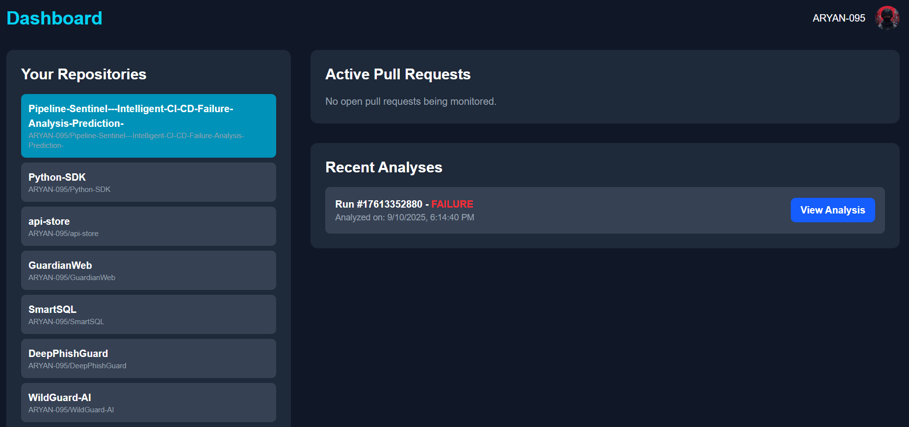
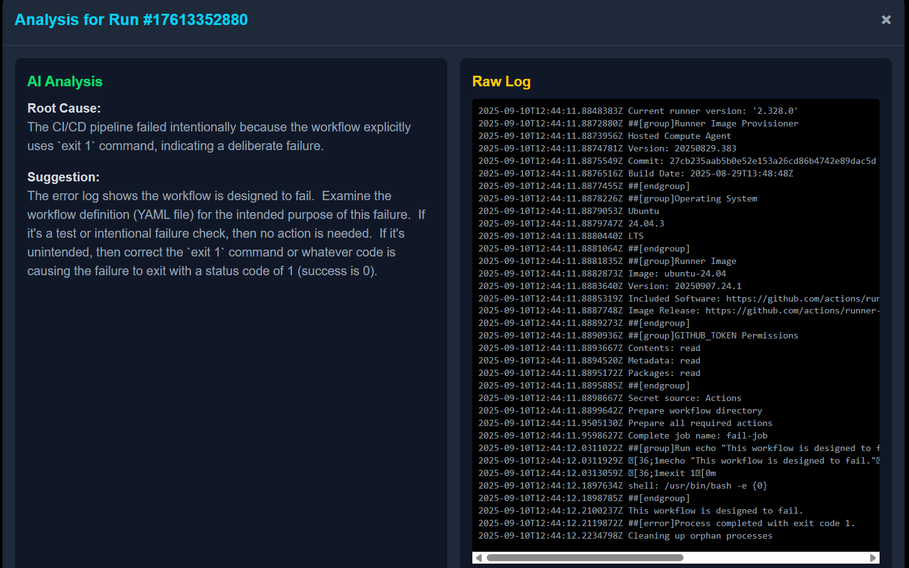

# Pipeline Sentinel 🛡️

**Intelligent CI/CD analysis and failure prediction before you merge.**

---

[](https://github.com)
[](https://opensource.org/licenses/MIT)




Pipeline Sentinel is a web-based tool that integrates with your GitHub repositories to bring intelligence to your CI/CD pipelines. It moves you from a reactive to a proactive workflow by automating error analysis and predicting high-risk changes.

### **What it does**

This tool is designed to solve two of the most frustrating problems in modern software development:

1.  **Automated Root Cause Analysis:** When a build fails, instead of digging through thousands of lines of logs, Pipeline Sentinel uses an AI to analyze the failure and provides a concise, human-readable summary of the root cause and a suggested fix.
2.  **Proactive Failure Prediction:** Before you even merge, Pipeline Sentinel analyzes new Pull Requests and generates a "risk score," predicting the likelihood that the changes will cause a CI/CD failure. This acts as an early warning system, helping your team catch potential issues before they block the main branch.

 

---

### **How It Works**

Pipeline Sentinel uses a multi-service architecture and GitHub webhooks to provide real-time feedback.

**1. AI Analysis Workflow (Reactive)**
* A `workflow_run` event on GitHub triggers a webhook when a build fails.
* Our Node.js backend receives the event and downloads the raw error log from the GitHub API.
* The log is sent to the Google Gemini API for analysis.
* The structured response (conclusion & suggestion) is saved and displayed on your dashboard.

**2. Prediction Workflow (Proactive)**
* A `pull_request` event triggers a webhook when a PR is opened or updated.
* The Node.js backend extracts features from the PR (lines added, files changed, etc.).
* These features are sent to a dedicated Python/Flask microservice.
* The service uses a trained machine learning model to calculate a risk score.
* The score is saved and displayed on your dashboard next to the open PR.

---

### **Technology Stack**

| Role               | Technology                                                                                                                              |
| ------------------ | --------------------------------------------------------------------------------------------------------------------------------------- |
| **Frontend** |    |
| **Backend** |   |
| **Prediction Service** |    |
| **AI & APIs** |   |
| **Deployment** |   |

---

### **Getting Started (Local Development)**

To run this project on your local machine, you will need to run three services simultaneously.

**Prerequisites:**
* Node.js (v18 or later)
* Python (v3.9 or later)
* An `ngrok` account for webhook tunneling.

**1. Clone the Repository**
```bash
git clone [https://github.com/your-username/intelligent-ci-analyzer.git](https://github.com/your-username/intelligent-ci-analyzer.git)
cd intelligent-ci-analyzer
```

2. Configure Environment Variables
You will need to create a .env file in the backend directory. See the Configuration section below for details.

3. Run the Backend
```
# Terminal 1
cd backend
npm install
node index.js
```

4. Run the Frontend

```
# Terminal 2
cd frontend
npm install
npm run dev
```

5. Run the Prediction Service
```
# Terminal 3
cd prediction-service
python -m venv venv
# Activate the virtual environment (source venv/bin/activate or .\venv\Scripts\activate)
pip install -r requirements.txt
python app.py
```

6. Run ngrok

```
# Terminal 4
ngrok http 3001
```

Use the forwarding URL provided by ngrok for your GitHub App and webhook configuration.

# Configuration
The backend requires a .env file (backend/.env) with the following keys:

```
# GitHub OAuth App credentials
GITHUB_CLIENT_ID=YOUR_CLIENT_ID_HERE
GITHUB_CLIENT_SECRET=YOUR_CLIENT_SECRET_HERE

# A random string for signing session cookies
SESSION_SECRET=a_very_long_and_random_string

# Google AI Studio API Key for Gemini
GEMINI_API_KEY=YOUR_GEMINI_API_KEY_HERE

# GitHub Personal Access Token (classic) for webhook processing
# Required scopes: 'repo', 'workflow'
GITHUB_PERSONAL_ACCESS_TOKEN=ghp_YOUR_TOKEN_HERE
```


# Future Work
This project is a functional proof-of-concept with many opportunities for expansion:

[ ] Improve Prediction Model: Incorporate more sophisticated features like author history, code complexity, and file churn.

[ ] Persistent Database: Replace the in-memory arrays with a PostgreSQL database.

[ ] IDE Integration: Develop a VS Code extension to show risk scores directly in the editor.

[ ] Broader Platform Support: Add integration for GitLab, Bitbucket, and CircleCI.


# Contributing
Contributions are welcome! Please feel free to open an issue or submit a pull request.

# License
This project is licensed under the MIT License. See the LICENSE file for details.
 
 
--